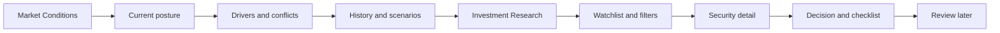
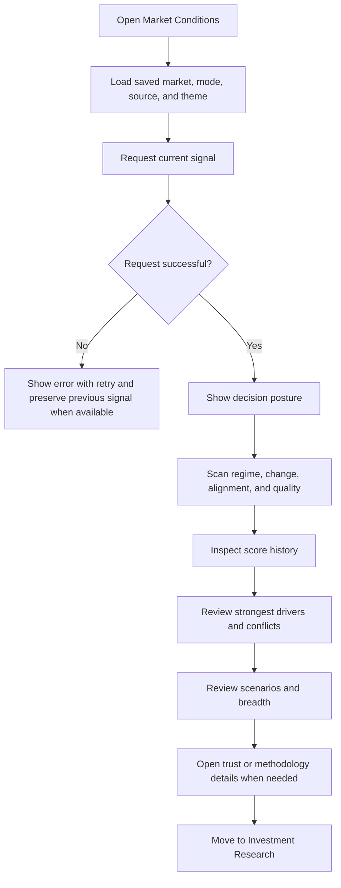
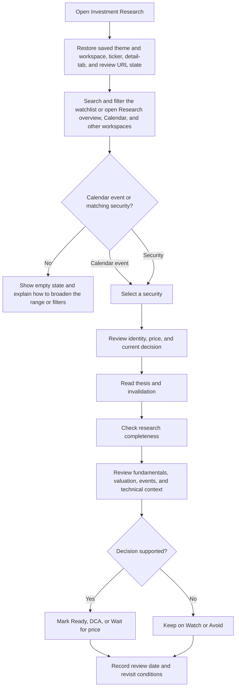
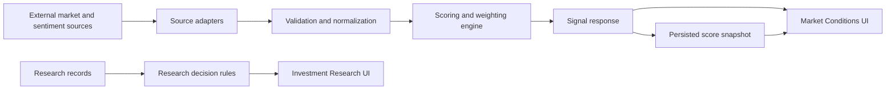

# Signal: Product Objective and User Flows

This document describes what Signal should accomplish and how users move through it. It intentionally avoids prescribing a visual style so the product can be rebuilt in a new repository with a different design direction.

## Product Summary

Signal is a personal market decision-support application with two connected workspaces:

1. **Market Conditions** turns market, sentiment, positioning, and volatility inputs into an explainable market-condition score.
2. **Investment Research** helps the user evaluate individual securities through a repeatable thesis, valuation, event, technical, and checklist process.

The product should reduce the time required to answer two questions:

- **What kind of market environment am I operating in?**
- **Given that environment, which securities deserve action, patience, monitoring, or avoidance?**

Signal summarizes evidence. It does not predict returns, guarantee outcomes, or provide financial advice.

## Core Objective

Help a self-directed investor move from scattered market information to a traceable decision without hiding disagreement, stale data, or uncertainty.

The product succeeds when a user can quickly:

- understand the current market posture;
- see what changed and which indicators caused it;
- distinguish supporting evidence from conflicting evidence;
- judge whether the data is fresh and sufficiently broad;
- identify conditions that would change the current interpretation;
- move from market context into structured security research;
- record a clear decision and the evidence behind it.

## Product Principles

### Decision first

Lead with the current interpretation and its practical implication. Evidence should support the conclusion rather than force the user to assemble it from unrelated widgets.

### Explain every score

A composite score must show its active inputs, normalized readings, weights, weighted contributions, freshness, and conflicts.

### Separate evidence from context

Scored indicators directly affect the composite. Articles, valuation backdrops, and general market news provide context unless explicitly connected to a scored input.

### Show uncertainty

Signal alignment measures indicator agreement, not forecast accuracy. Coverage, freshness, noise, missing sources, and model limitations must remain visible.

### Preserve interpretation mode

The same score has different implications in Momentum and Contrarian modes. Labels, explanations, thresholds, and scenarios must stay mode-aware.

### Keep research repeatable

Every security should be evaluated through the same categories and checklist so decisions are comparable over time.

### Keep the design replaceable

Business rules, data normalization, scoring, and decision logic should remain outside presentation components. A new design should not require rewriting domain logic.

## Primary User

A self-directed investor who follows US and Malaysian markets and wants a compact but transparent workflow for market context and stock research.

Primary jobs to be done:

- Check the market environment before making a portfolio decision.
- Understand whether indicators agree or conflict.
- Compare the current score with recent history.
- Find securities that are actionable or waiting for a better entry.
- Review a security using a consistent research framework.
- Revisit what would invalidate a thesis or change a decision.

## Product Structure

The two workspaces share navigation, theme preference, terminology, and a consistent hierarchy, but each has a different purpose:

- Market Conditions is a **top-down environment assessment**.
- Investment Research is a **bottom-up security assessment**.

## Flow 1: Market Conditions

### User goal

Understand the current market environment, the evidence behind it, and what could change the interpretation.

### Entry controls

The user can configure:

- **Market:** US or Malaysia.
- **Mode:** Momentum or Contrarian.
- **Sentiment source:** include or exclude the applicable social/news source.
- **Theme:** light or dark.

Changing market, mode, or source inclusion refreshes the conditions view while preserving the previous result until the new result is available.

### Reading order

1. **Decision posture**
   - Plain-language headline.
   - Short synthesis of supporting and conflicting evidence.
   - Composite score and current score zone.
   - Important caveat when freshness, coverage, or noise limits the result.

2. **At-a-glance summary**
   - Market regime.
   - Change from the previous snapshot.
   - Signal alignment.
   - Data quality summary.

3. **Historical context**
   - Recent score history.
   - Current score relative to mode-aware zones.
   - Previous score and date.

4. **Driver evidence**
   - Active indicator name.
   - Raw reading.
   - Normalized score.
   - Effective weight.
   - Weighted contribution.
   - Freshness.
   - Conflict with the majority interpretation.
   - Strongest directional influence should be surfaced first.

5. **Forward scenarios**
   - Conditions that would strengthen, weaken, or reverse the current interpretation.
   - Scenario wording must match the selected market and mode.

6. **Market breadth and context**
   - Major index direction and breadth.
   - Articles tied to an affected driver when that relationship exists.
   - Otherwise, articles are labeled as general market background.

7. **Trust and methodology**
   - Evidence concentration.
   - Coverage and freshness limitations.
   - Source cadence, horizon, update date, and source link.
   - Methodology and non-advice disclosure.

### Market Conditions flow

## Flow 2: Investment Research

### User goal

Find a security, understand the investment case, and determine whether it is ready for action.

### Entry controls

The user can:

- search by ticker or company name;
- filter by market;
- filter by current decision;
- select a security from the watchlist;
- switch between Watchlist, Discovery, Compare, Calendar, and Alerts through desktop tabs or the narrow-screen workspace selector;
- compare live quality, valuation, and technical evidence for up to three watchlist securities;
- share or restore workspace, ticker, detail-tab, and review state through URL parameters without discarding market-handoff or unknown query context;
- switch between light and dark themes.

### Research decision states

- **Ready:** research checks are strong, downside is acceptable, valuation is reasonable, and price is in the buy zone.
- **DCA:** an owned, high-quality position remains suitable for incremental buying.
- **Wait for price:** the thesis is acceptable but valuation or entry price is not.
- **Watch:** research is incomplete or the setup is not yet decisive.
- **Avoid:** thesis quality, downside, or valuation makes the security unsuitable.

These states should come from domain rules rather than manual UI coloring.

### Reading order

Daily attention and portfolio guardrails remain available from the collapsed Research overview disclosure, while the watchlist and selected-security detail stay visible as the primary workspace.

1. **Watchlist**
   - Ticker.
   - Current price.
   - Current decision.
   - Selected state.

2. **Security identity**
   - Ticker and company name.
   - Current price and daily change.
   - Last-reviewed date.

3. **Overview**
   - Why the security is interesting.
   - Bull case.
   - Bear case.
   - Buy and sell triggers.
   - Thesis invalidation.
   - Research-check completion.
   - Current decision and next incomplete check.
   - Compact fundamentals snapshot.

4. **Fundamentals**
   - Sector and industry.
   - Revenue, margins, cash flow, debt, cash, and share-count trends.
   - Business description.

5. **Valuation**
   - Target buy zone.
   - P/E, forward P/E, price-to-sales, EV/EBITDA, FCF yield, and dividend yield.
   - Historical range and peer context.

6. **Events**
   - Next and previous earnings.
   - Revenue and EPS results.
   - Guidance and event notes.

7. **Technical context**
   - Moving averages.
   - 52-week range.
   - RSI, MACD, and volume.
   - Support and resistance.

8. **Comparison**
   - Current decision for each selected security.
   - Live price, growth, margin, valuation, and technical evidence.
   - Explicit unavailable states when a free source does not cover a metric.
   - A maximum of three securities so the evidence remains scannable.

9. **Catalyst and review calendar**
   - A 30-day or 90-day chronological view of scheduled research reviews, stale-review deadlines, and monitored US earnings.
   - List and compact calendar presentations over the same typed event contract.
   - Market, ticker, and event-type filters that operate without changing a saved record.
   - UTC source dates plus browser-local generated-time context.
   - Changed-date, loading, empty, partial-provider, error, and retry states.
   - Direct navigation to the editable review workflow or the ticker Events tab.

### Investment Research flow

## Connection Between Workspaces

The market score should inform research context without automatically deciding whether an individual security is investable.

Recommended relationship:

1. User reviews the market posture.
2. User understands whether the environment supports risk-taking or caution.
3. User opens Investment Research.
4. The selected security is evaluated independently on thesis, quality, valuation, and price.
5. Market context may adjust urgency or position sizing, but it does not overwrite the security-level decision rules.

Market Conditions can pass a bounded, validated context reference into Research. That handoff remains visibly labeled evidence-only and never silently merges the market score with security decisions or checklist state.

## Scoring Semantics

The composite is a `0-100` sentiment and momentum index.

| Range | Momentum interpretation | Contrarian interpretation |
| --- | --- | --- |
| `0-39` | Negative | Low risk |
| `40-64` | Mixed | Elevated |
| `65-84` | Positive | Cautionary |
| `85-100` | Strong positive | Extreme risk |

Important constraints:

- These are model interpretation zones, not validated return thresholds.
- Signal alignment means indicator agreement, not probability of success.
- Disabled or unavailable source weights are redistributed across active sources.
- High US volatility can activate a special weighting regime.
- Slow valuation measures should remain context rather than dominate a tactical score.
- Every scored source needs a visible cadence, horizon, and update timestamp.

Detailed weighting and normalization rules belong in a separate scoring specification so they can evolve without changing this product-flow document.

## System Flow

### Suggested boundaries for a new repository

- **Routes/pages:** navigation and composition only.
- **API handlers:** validate parameters and return typed responses.
- **Source adapters:** fetch and parse external data.
- **Normalization:** convert raw values into comparable indicator scores.
- **Scoring engine:** weights, overrides, composite score, alignment, and conflicts.
- **Snapshot store:** score history and previous-score comparisons.
- **Research domain:** watchlist records, checklist state, and decision rules.
- **Presentation components:** render typed domain data without reproducing scoring logic.

## Minimum Data Contracts

### Market signal

The market response should include:

- composite score, tier, market, and mode;
- plain-language interpretation;
- active components with raw value, normalized score, effective weight, and timestamp;
- alignment level and conflicting indicators;
- quality information for freshness, coverage, and noise;
- score drivers and weighted contributions;
- score history and previous-score delta;
- index breadth;
- relevant articles or general market context;
- interpretation limitations and source methodology;
- optional source-toggle counterfactual.

### Research record

A research record should include:

- symbol, company, market, and provider symbol;
- price and daily change;
- thesis, bull case, and invalidation;
- fundamentals, valuation, events, and technical context;
- target buy zone and whether price is currently inside it;
- thesis strength, valuation state, and ownership state;
- checklist answers;
- calculated decision;
- decision confidence, observed price and benchmark context, next-review date, and the later outcome assessment linked to a prior review;
- a narrow position plan covering allocation, cost or planned entry, and invalidation price;
- last-reviewed timestamp.

## Required Application States

Every redesign should account for:

- initial loading;
- background refresh while preserving previous data;
- complete success;
- partial or stale data;
- request failure with retry;
- no matching research results;
- disabled sentiment source;
- one or more missing indicators;
- light and dark themes;
- mobile, tablet, and desktop navigation;
- keyboard focus and screen-reader labels.

## Design Freedom

The new repository may change:

- page composition and navigation model;
- typography and color system;
- chart type and visual encoding;
- density and progressive-disclosure patterns;
- component library and styling approach;
- desktop and mobile layout strategy.

The redesign should preserve:

- the two-workspace product model;
- decision-first hierarchy;
- mode-aware score meaning;
- transparent driver contributions and conflicts;
- freshness, coverage, and limitations;
- market-specific terminology;
- research categories and decision rules;
- usable loading, error, empty, and responsive states.

## New Repository Delivery Sequence

### Phase 1: Domain foundation

- Define typed market-signal and research-record contracts.
- Implement scoring and research-decision rules independently of UI.
- Add fixtures representing US/MY, Momentum/Contrarian, stale data, missing data, and conflicting indicators.

### Phase 2: Market Conditions

- Build market, mode, source, and theme controls.
- Implement posture, summary, history, drivers, scenarios, context, and methodology.
- Verify all score labels change correctly by mode.

### Phase 3: Investment Research

- Build search, filters, watchlist, ticker URL state, and research detail.
- Implement overview, fundamentals, valuation, events, and technical sections.
- Calculate the current research decision from checklist and valuation inputs.

### Phase 4: Data integration

- Replace fixtures with validated source adapters.
- Persist score history and research review state.
- Add refresh scheduling and cache behavior.

### Phase 5: Product hardening

- Test loading, stale, partial, failure, and empty states.
- Verify responsive layouts and keyboard interaction.
- Add source attribution and methodology disclosures.
- Confirm that visible language does not imply forecast certainty or financial advice.

## Acceptance Criteria

A redesign is functionally complete when:

1. A user can select US or Malaysia and Momentum or Contrarian mode.
2. The score, labels, explanation, and scenarios reflect that configuration.
3. The user can identify the strongest driver and all conflicting indicators without reading every row.
4. The user can see score history, change, freshness, coverage, and limitations.
5. Context articles are clearly distinguished from scored evidence.
6. The user can search and filter the research watchlist.
7. Selecting a ticker updates the URL and the complete research record.
8. The user can review overview, fundamentals, valuation, events, and technical information.
9. The security decision follows explicit checklist, thesis, valuation, and price rules.
10. The product works in light/dark themes and mobile/desktop layouts.
11. Loading, refresh, error, partial-data, and empty states are usable.
12. Domain logic can be tested without rendering the UI.

## One-Sentence Build Brief

Build a design-forward but evidence-transparent investment decision-support application that combines an explainable market-conditions view with a structured security-research workflow, while keeping scoring, uncertainty, and decision rules visible and independent from the visual design.
